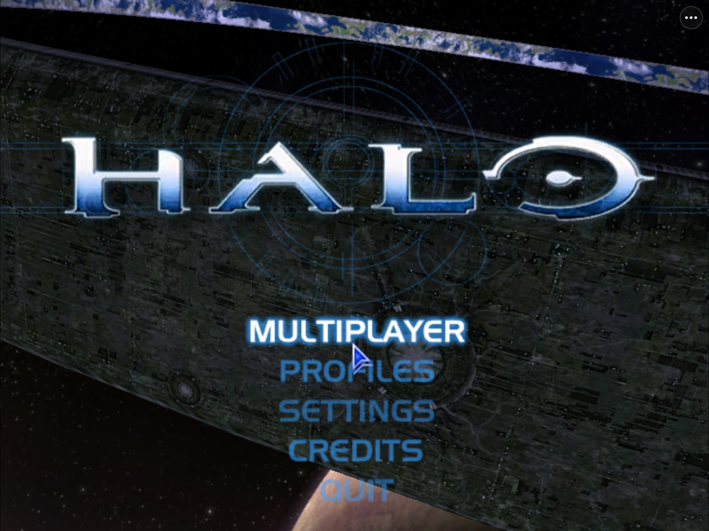

# HaloPad

<p align="center">
  <strong>Halo: Combat Evolved on iPhone and iPad.</strong><br>
  The Xbox edition with online matches of up to 128 players, the original campaign, and Halo Custom Edition
  with its community servers. Touch controls, controllers and real networking.
</p>

<p align="center">
  
  
  
  
  
  <a href="https://discord.gg/xwHfUD2bxW"></a>
</p>



*HaloPad at Halo's own main menu. Physical iPhone 14 and iPad Pro builds play local and online matches; see [Current status](#current-status).*

**[What's new](#whats-new-in-02) · [What is it](#what-is-halopad) · [Status](#current-status) · [Playing](#playing) ·
[Build it](#build-and-install) · [FAQ](#frequently-asked-questions) · [Discord](https://discord.gg/xwHfUD2bxW)**

> [!IMPORTANT]
> **Bring your own game.** HaloPad needs your own legitimate copy of Halo: Custom Edition 1.10 for PC,
> and for the Xbox edition your own Halo: Combat Evolved Xbox disc image.
> This repository contains no Halo executable, maps, sounds, saves, product key, engine source or
> translated game code.
>
> **Built on your Mac.** There is no prebuilt IPA: every HaloPad contains code made from your own game,
> so you build it on a Mac with one command and sign it with your own Apple profile (see
> [Build and install](#build-and-install)). It is playable on real hardware today; frame pacing and
> some Xbox graphics are still being tuned.
>
> **AI disclosure:** HaloPad is developed with substantial AI assistance for code, testing,
> documentation and debugging. The [status log](docs/STATUS.md) records what has actually been
> checked, and on which device.

**Questions, testing or bugs?** Join the [Discord](https://discord.gg/xwHfUD2bxW) or
[open an issue](https://github.com/chrissotraidis/projectreach/issues/new/choose).

## What's new in 0.2

- **The Xbox edition.** HaloPad now runs [halo-ce-universal](https://github.com/cybersecurity/halo-ce-universal),
  the port of the Halo CE Xbox decompilation: the original campaign, and online matches of up to 128
  players with people on PC, Linux and Android through its game browser.
- **Two editions, one app.** Pick Xbox or Custom Edition at launch; the ⋯ menu is the same in both and
  **Switch Edition** moves between them.
- **Smoother Custom Edition.** Halo's own 30 FPS throttle no longer makes frames uneven, and Halo starts
  normally with the product ID made from your own key.
- **One-command builder** (`scripts/builder/build.sh`), which is also HaloPad's PadMint recipe.

[Release notes](https://github.com/chrissotraidis/projectreach/releases/tag/v0.2.0)

## What is HaloPad?

HaloPad (the codebase is Project Reach) brings two versions of Halo: Combat Evolved to iPhone and iPad.

For **Halo: Custom Edition**, it takes the game's 32-bit Windows code and translates it to native ARM64
ahead of time, on your Mac. Nothing is compiled on the device while you play, so it needs no JIT.

Around that code, HaloPad supplies the Windows services the game expects: Direct3D 9 rendered through
Metal, DirectInput mapped to touch and game controllers, audio, files, the registry and Winsock
networking. Every one of Halo's 804 shader programs is translated to Metal and checked against a
reference interpreter. It is a compatibility runtime built for one game, not a general Windows emulator,
and it is not a streaming client.

Because it speaks Custom Edition's own network protocol, HaloPad joins the community-run servers in
Halo's in-game lobby, alongside PC players.

For the **Xbox edition**, your Mac downloads and builds the halo-ce-universal engine from source and
HaloPad runs it with Metal graphics (through ANGLE), touch controls and the same ⋯ menu. Its new
netcode lets one player host and everyone else join over the internet, up to 128 players per match.

## Two editions

When a personal build includes the Xbox engine, HaloPad asks which edition to open at every launch:

| | Halo Custom Edition (Windows, left) | Halo: Combat Evolved (Xbox, right) |
| --- | --- | --- |
| Engine | Your own `haloce.exe` 1.10, translated ahead of time | [halo-ce-universal](https://github.com/cybersecurity/halo-ce-universal), a port of the Xbox decompilation, fetched and built on your Mac |
| Game files | Your Custom Edition package | Your own Xbox disc image, imported in the app |
| Online | Custom Edition servers and LAN | System link and internet games with other halo-ce-universal players (PC, Linux, Android), up to 128 per match, on the same build |
| Campaign | No | The original Xbox campaign (preview) |
| Status | Developer preview | Experimental preview |

Each edition keeps its own saves and multiplayer, and both share HaloPad's touch controls. To switch,
close HaloPad and open it again. The Xbox card has **Original** and **Sharper** graphics.

The Xbox engine is never part of this repository. Your Mac downloads the pinned upstream release
(currently build 85) and builds it from source. Upstream notes that parts of the
decompilation were reconstructed with help from leaked Bungie material, which is why the Xbox edition
is only ever a personal build; see [Xbox engine](docs/XBOX-ENGINE.md).

**Playing together on the Xbox edition:** everyone in a match needs the same upstream build. HaloPad
shows yours on the Xbox card and in **⋯ › About** (for example *build 85*); rebuild after HaloPad
moves its pin to pick up a newer one. Its internet game browser finds games through public STUN and
MQTT relay servers, as upstream does; no HaloPad server is involved.

## Current status

Builds start Halo normally. The one-command builder turns your product key into the product ID Halo's
installer would write, on your Mac and into your app only.

| Area | Where it stands |
| --- | --- |
| **iPad** | Physical iPad Pro 12.9" (6th gen) imports its game package, plays local Slayer matches and has joined online games. Halo's own 30 FPS throttle made frames uneven on iOS; HaloPad no longer applies it (about 110 FPS in the iPad Simulator; physical rates are being re-measured). A crash in busy scenes (a shader needing more than eight texture setups) is fixed. First-time loading of new effects still stutters |
| **iPhone** | Physical iPhone 14 imports, creates a profile and plays a local LAN match, including 1280 × 720 widescreen. About 30 FPS in a static scene; loading and busy play are still slow |
| **Multiplayer** | Windows edition: Halo's own LAN and Internet menus work, and a physical iPad has joined public Custom Edition servers. Xbox edition: a physical iPad Pro has joined internet games through the decompilation's game browser. iPhone online play has not had a full test |
| **Controls** | Movable, resizable touch overlay, look-speed settings, iOS keyboard for names and chat, Xbox-style controllers (including connecting after launch) and iPad trackpad/mouse in menus |
| **Custom maps** | Import `.map` files from the app menu. Client DLL mods (Chimera, OpenSauce, HAC2) do not load |
| **Campaign** | Through the Xbox edition: menus, campaign, controls, Save and Quit and reload pass in the iPad Simulator; a physical iPad has run a preview build. Custom Edition has no campaign |
| **Xbox edition** | Preview. Campaign and internet multiplayer run on a physical iPad Pro. Some textures and effects still render differently from the original, and frame pacing is still being tuned |
| **Distribution** | Source only. Build your own on a Mac with one command and your own game files |

Details, measurements and open gates live in [docs/STATUS.md](docs/STATUS.md) and the
[device-readiness loop](docs/HaloPad-GOAL-LOOP-PHASE3.md).

## Playing

On first launch, choose your prepared `.halopad.zip` game package. Create a Halo profile, then use the
game's own **Multiplayer** menus to host or join.

- **⋯ menu:** the same in both editions: touch settings, controller guide, display options,
  **Report a Problem**, **Share Diagnostic Log** and **Switch Edition** (closes HaloPad; the edition
  picker appears when you open it again). Windows adds keyboard and chat, join a server by address and
  custom-map import; Xbox adds System Link
- **Touch:** move and resize the overlay; tune look speed under **Controls › Look Speed & Touch Settings**
- **Controllers:** connect before opening HaloPad for the most reliable result; connecting later is
  supported (tested in the Simulator so far). In Halo's menus the D-pad or left stick
  moves, **A** selects and **B** goes back; **Menu** pauses. While the on-screen keyboard is open
  (chat, console, a profile name), **A** sends Enter and **B** cancels. Halo's "Button 6" pickup
  prompt is **RB** on an Xbox controller
- **Leaving a match:** **⋯ › Open Leave Game Menu…** opens Halo's pause menu; choose **Leave Game** there
- **Resolution:** Halo renders at 800 × 600 by default in its original 4:3 shape; Halo's **Settings ›
  Video** offers sharper modes up to the screen's own size (on a 12.9-inch iPad Pro, 4:3 modes such as
  1600 × 1200 and 2048 × 1536). Halo's 1280 × 720 mode gives a true widescreen view, or use **Fill**
  to stretch 4:3
- **Smoother recording:** the first time a map, weapon or effect appears, its graphics are prepared and
  play can hitch for up to about a second. Later appearances are much faster, so play a warm-up
  match on the same map before recording

## Build and install

You need:

- a Mac with Apple silicon and Xcode
- your own Halo: Custom Edition 1.10 files
- an iPhone or iPad on iOS/iPadOS 17 or later, with Developer Mode on
- an Apple development profile for HaloPad's bundle ID that allows **Extended Virtual Addressing** and
  **Increased Memory Limit** (the runtime reserves Halo's full 32-bit address space)

Install the tools once with `brew install sevenzip winetricks llvm lld && brew install --cask wine-stable`
and check with `scripts/doctor.sh`. Then put your own `HaloCESetup.exe` and a `product-key.txt` with
your Halo PC key in one folder and run:

```sh
scripts/builder/build.sh /path/to/that/folder --ipa HaloPad.ipa
```

It downloads Bungie's free 1.10 update (or uses `haloce-patch-1.0.10.exe` beside the installer), checks
everything by hash, applies the update, translates Halo, builds the app and writes an unsigned IPA plus
`HaloPad.ipa.data/Halo-CE.halopad.zip`. Install the IPA with your own signing (see
[Installing on iPhone or iPad](docs/INSTALL-IPHONE.md)), open HaloPad and choose the game package.
Halo needs the product ID its installer writes: the builder makes it from your key with the
installer's own `PIDGen.dll` (`scripts/product-id.sh`) and puts it in your app only. A first build
takes about an hour on an Apple silicon Mac.

The same builder is HaloPad's [PadMint](https://github.com/chrissotraidis/padmint) recipe
([padmint.json](padmint.json)), so PadMint will be able to run it for you from an app instead of
Terminal. That listing is in progress. Either way, your game files, key, translated code and signing
never leave your Mac.

**An app you build contains code translated from your game: it is yours alone. Never share or upload it.**

### Adding the Xbox edition

The Xbox edition is optional. After the builder above has run once, build the engine and then the app
with both editions, signed with your own identity and profile:

```sh
# the pinned ANGLE renderer source (a small sparse checkout of WebKit), outside this repository
angle_work=$(mktemp -d /tmp/halopad-angle.XXXXXX)
git clone --filter=blob:none --depth=1 --no-checkout https://github.com/WebKit/WebKit.git "$angle_work/WebKit"
git -C "$angle_work/WebKit" fetch --depth=1 origin a1fb7ce122d0cd99f7d6cc82775f02565e266ece
git -C "$angle_work/WebKit" sparse-checkout set --cone Source/ThirdParty/ANGLE
git -C "$angle_work/WebKit" checkout --detach a1fb7ce122d0cd99f7d6cc82775f02565e266ece
export XBOX_ANGLE_SOURCE="$angle_work/WebKit/Source/ThirdParty/ANGLE"

export HALOPAD_XBOX_RENDERER=angle-metal HALOPAD_XBOX_GUEST_ADAPTATION=render-camera-v1
scripts/xbox/build-ios.sh --device      # fetches and builds the pinned engine on your Mac
.venv/bin/python scripts/build-ios-app.py --iphoneos --identity "Apple Development: …" \
    --profile your.mobileprovision --product-id generated/product-id/product-id.txt
```

The two `HALOPAD_XBOX_*` settings select the Metal renderer and the camera and graphics fixes the
tested iPad build uses. The engine build also needs Homebrew `llvm` and about 40 GB free.
A build that includes the Xbox engine stops at a signed `HaloPad.app` and never creates an IPA; install
it with `xcrun devicectl device install app`, then pick your disc image in the app.
[Xbox engine](docs/XBOX-ENGINE.md) covers requirements, updates to newer upstream releases and the
tested disc (NTSC-US, maps build `01.10.12.2276`).

Install updates over the existing app. Deleting HaloPad deletes your profiles and imported files, so back
up its `Documents` and `Library` first if you ever need to change signing.

## Known issues

- **Loading and frame pacing.** First-time graphics preparation causes hitches. Halo's 30 FPS throttle
  is no longer applied (Halo's Video menu may still show it); physical-device frame rates are being
  re-measured, and iPhone play has been slower.
- **Controller dropouts.** Some players have seen a controller stop responding after reconnecting it or
  switching from touch; in one report it came back after starting a new game. If it happens, please
  share the diagnostic log (below).
- **Video mode changes on iPad.** Changing Halo's resolution in its Video settings is tested on iPhone,
  not yet on iPad. The default 800 × 600 is the safest choice.
- **Touch ergonomics.** Two-thumb feel is still being tuned on real phones.
- **Online on physical phones.** Online games have been joined from a physical iPad; iPhone online play
  has not had a full test.
- **Xbox edition preview.** Some textures and effects still look softer or different from the original,
  and play can stutter. Online, everyone needs the same upstream build (shown in **⋯ › About**). One
  rare crash during a long Battle Creek camera test was seen once in the Simulator; crash reports now
  identify the exact fault if it happens again.

## Getting help

- **Discord:** [discord.gg/xwHfUD2bxW](https://discord.gg/xwHfUD2bxW) for questions, testing and updates
- **Bug reports:** use **⋯ › Report a Problem** or [open an issue](https://github.com/chrissotraidis/projectreach/issues/new/choose).
  Include your device, iOS version, build, map, what you tapped and whether a controller was connected.
  Please never attach game files, maps or app packages.
- **Diagnostic log:** HaloPad keeps a small log of controller, display, stall and crash events in
  **Files › On My iPad/iPhone › HaloPad › HaloPad Logs**, or share it from **⋯ › Help › Share Diagnostic
  Log…**. It contains no typed text, names, chat or server addresses. Attach it to bug reports

## Frequently asked questions

### Can I download an IPA?

No, and that is deliberate. A working HaloPad contains code translated from your copy of Halo, and the
Xbox edition contains an engine built from a decompilation, so neither can be handed out as a download.
Instead you build your own on a Mac, with one command; PadMint support is on the way to make that a few
clicks.

### Is this an emulator?

Not in the usual sense. Halo's x86 code is translated to ARM64 ahead of time and runs natively, with no
JIT. HaloPad then provides the Windows, Direct3D 9, input, audio and network pieces the game calls into.

### Can I play with people on PC?

Yes. The Windows edition speaks Custom Edition's own network protocol and joins the community-run PC
servers. The Xbox edition plays with other halo-ce-universal players on PC, Linux and Android, in
matches of up to 128 players, when everyone has the same build. The two editions cannot play each other.

### Which version of Halo works?

For the Windows edition, Halo: Custom Edition 1.10 only; the build checks your files against that exact
version. For the Xbox edition, an original Xbox Halo: Combat Evolved disc image; the NTSC-US release is
the tested one. The PC retail `halo.exe` and the Master Chief Collection are not supported.

### Does it run on iPhone?

Yes. An iPhone 14 has imported the game and played a local match, including in widescreen. Loading
and busy scenes are slow there for now.

### Do controllers work?

Yes, iOS-supported controllers work. Connecting before HaloPad opens is the most tested path.
**⋯ › Controller Guide** shows the mapping.

### Can I use mods and custom maps?

Custom `.map` files, yes: **⋯ › Add Custom Maps…**. Windows DLL mods such as Chimera, OpenSauce and
HAC2 cannot load into a translated game.

### Will updates keep my profile?

In-place updates have preserved app data in testing. Install over the existing app and never delete it
to update.

## Documentation

- [Install guide](docs/INSTALL-IPHONE.md): signing, packaging and device setup
- [Xbox engine](docs/XBOX-ENGINE.md): the optional Xbox edition, its build, updates and boundaries
- [Status](docs/STATUS.md) and [journal](docs/JOURNAL.md): tested builds and observations
- [Device-readiness loop](docs/HaloPad-GOAL-LOOP-PHASE3.md): the iPhone and iPad acceptance plan
- [Execution model](docs/EXECUTION-MODEL.md): translation coverage and guest dispatch
- [Graphics contract](docs/GRAPHICS-CONTRACT.md) and [D3D9 inventory](docs/D3D9-INVENTORY.md): Direct3D 9 on Metal
- [Runtime and networking](docs/G3-RUNTIME.md): Windows services and public-server results
- [Rights status](docs/RIGHTS-STATUS.md): inputs, generated code and publication boundaries

## Community and support

[Join the Discord](https://discord.gg/xwHfUD2bxW) for help and news. It is one
community for HaloPad and its sibling projects, such as KartPad, BlueWake and
MeleePad: ask about setup and installing, share how it runs on your device, and
hear about new releases first.

Found a bug? [Open an
issue](https://github.com/chrissotraidis/projectreach/issues) with your device,
its OS version, and the steps that led to it.

## Credits

HaloPad stands on a lot of other people's work. Thank you to:

- [SR](https://github.com/M-HT/SR) by M-HT, the static x86 recompiler at the heart of the translation pipeline
- [halo-ce-universal](https://github.com/cybersecurity/halo-ce-universal) by cybersecurity and its
  contributors, the Xbox engine port, built on the decompilations [bnunu/halo-1](https://github.com/bnunu/halo-1)
  and [punpckhdq/halo](https://github.com/punpckhdq/halo)
- [ANGLE](https://chromium.googlesource.com/angle/angle), whose Metal backend draws the Xbox edition
- [xboxrecomp](https://github.com/sp00nznet/xboxrecomp) by sp00nznet, used for runtime research
- [SunPad](https://github.com/chrissotraidis/sunpad), whose touch overlay and three-dot menu HaloPad adapts
- Xiph.Org contributors for Ogg and Vorbis, and udis86 for disassembly
- The Halo Custom Edition community, who have kept servers, maps and the master server running for over twenty years

Each project keeps its own license and notices. This repository does not claim a blanket license over
upstream work or Halo content.

## Legal

HaloPad is an independent fan project. It is not affiliated with or endorsed by Microsoft, Xbox or
Halo Studios. Halo and Halo: Custom Edition are trademarks of their respective owners. HaloPad grants
no rights to Halo content: you need your own legitimate copy and are responsible for the laws that apply
to it. No project-wide license has been chosen yet; see [rights status](docs/RIGHTS-STATUS.md).
